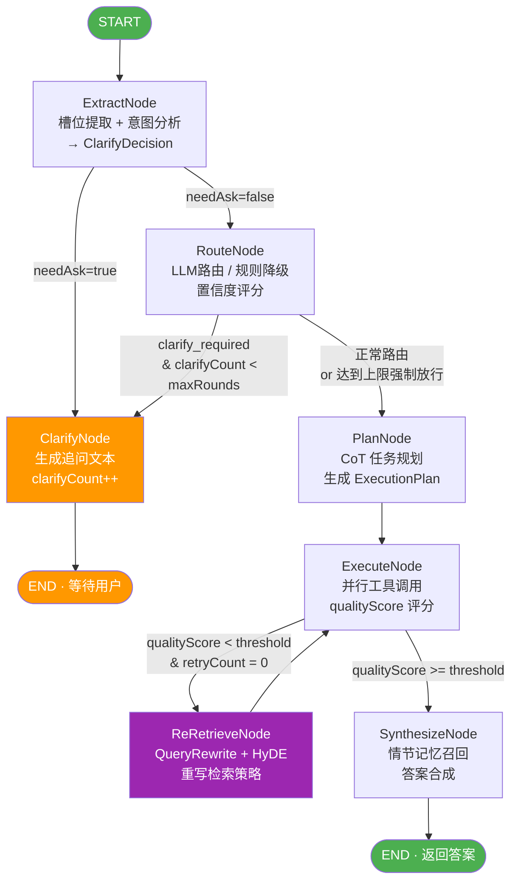

# Prism — 多领域智能答疑 Agent

> 一个生产级 Java Agent 项目，覆盖 Agent 开发全知识图谱：StateGraph 状态机、Plan-and-Execute、Hybrid RAG、五层记忆、LLM-as-Judge 评估、A2A 协议。

---

## 项目定位

Prism 是一个面向**支付 / 交易 / 营销**三大领域的智能答疑系统。用户可以用自然语言提问，系统自动完成槽位提取、意图路由、任务规划、工具调用、知识检索和答案合成。

| 维度 | 说明 |
|---|---|
| 核心范式 | Plan-and-Execute + Reflection |
| Agent 架构 | Multi-Agent（Orchestrator + AgentSkill Sub-Agent） |
| 执行引擎 | Spring AI Alibaba LangGraph StateGraph |
| RAG 策略 | BM25 + Vector + RRF 混合检索 + Advanced RAG Pipeline |
| 记忆层次 | L0 语义缓存 → L4 情节记忆，五层分层 |
| 评估体系 | Rule-based + LLM-as-Judge，黄金集自动回归 |
| Agent 互通 | Google A2A 协议（`/.well-known/agent.json`） |

---

## 技术栈

```
Java 21 + Spring Boot 3.x
Spring AI Alibaba (LangGraph StateGraph)
Spring AI (EmbeddingModel, VectorStore, ChatClient)
Apache Tika (文档解析)
Redis (会话持久化 + 语义缓存 KV + VectorStore)
SnakeYAML (评估黄金集加载)
SiliconFlow API / OpenAI 兼容接口
```

---

## 整体架构

```
┌─────────────────────────────────────────────────────────────────┐
│                         Prism Agent System                       │
│                                                                  │
│  ┌──────────────────────────────────────────────────────────┐   │
│  │              GraphAgentRuntime (Orchestrator)             │   │
│  │                                                           │   │
│  │  ExtractNode → RouteNode → PlanNode → ExecuteNode        │   │
│  │       ↑ ClarifyNode           ↑ ReRetrieveNode           │   │
│  │                               └─ SynthesizeNode          │   │
│  └──────────────────────────────────────────────────────────┘   │
│                           │                                      │
│            ┌──────────────┼──────────────────┐                  │
│            ▼              ▼                  ▼                   │
│  ┌──────────────┐ ┌─────────────┐ ┌───────────────────┐        │
│  │ AgentSkill   │ │  RAG Engine │ │   Memory Stack     │        │
│  │ Sub-Agent    │ │             │ │                    │        │
│  │ (Skill+Tool) │ │ BM25+Vector │ │ L0 SemanticCache   │        │
│  │              │ │ +RRF+Rerank │ │ L1 WorkingMemory   │        │
│  │ Payment/     │ │             │ │ L2 ConvHistory     │        │
│  │ Trade/       │ │ QueryRewrite│ │ L3 Summary(LLM)    │        │
│  │ Marketing    │ │ +HyDE       │ │ L4 EpisodicRecall  │        │
│  └──────────────┘ └─────────────┘ └───────────────────┘        │
│                                                                  │
│  ┌─────────────────┐  ┌──────────────┐  ┌──────────────────┐   │
│  │  EvalRunner      │  │  A2A Protocol│  │  MCP Server       │   │
│  │  (LLM-as-Judge) │  │  Agent Card  │  │  AgentMcpTools   │   │
│  └─────────────────┘  └──────────────┘  └──────────────────┘   │
└─────────────────────────────────────────────────────────────────┘
```

---

## StateGraph 状态机流转（Graph 版本）

核心执行引擎采用 **Spring AI Alibaba LangGraph StateGraph**，将每个 Agent 处理阶段抽象为独立节点，通过 `OverAllState` 在节点间传递状态，彻底告别 if-else 意大利面代码。



### 死循环防护

**场景**：当用户问题横跨多个领域，RouteNode 置信度不足 → 路由到 ClarifyNode → 用户补充信息 → ExtractNode → RouteNode → 再次低置信度，形成死循环。

**解决方案**：在 `RouteNode.process()` 和 `AgentRuntime.route()` 中均加入 `clarifyCount >= maxClarifyRounds` 检查：达到上限时将 `handleMode` 强制改为 `knowledge_and_tool`，跳过澄清直接进入规划阶段。

```java
// RouteNode.java
if (memory.clarifyCount() >= properties.runtime().maxClarifyRounds()) {
    RouteResult forced = new RouteResult(..., "knowledge_and_tool", ...);
    result.put(AgentStateKeys.NEXT_NODE, "plan");  // 强制放行
}
```

### 与经典 While-Switch 的对比

| 维度 | While-Switch (AgentRuntime) | StateGraph (GraphAgentRuntime) |
|---|---|---|
| 节点扩展 | 修改 switch 分支 | 新增 Node + addNode() |
| 状态传递 | AgentRunContext 贯穿 | OverAllState 键值共享 |
| 断点恢复 | 不支持 | MemorySaver Checkpoint |
| 可视化 | 无 | Graph 拓扑可序列化 |
| 生产推荐 | 简单场景 | 复杂多节点 Agent |

---

## Skill 设计 — 两层架构

### 为什么需要两层？

单纯用工具（Tool）无法表达"哪个场景用哪个工具"的领域知识，TaskPlanner 会硬编码大量 if-else。引入 **Skill 两层架构** 后，规划逻辑内聚到 Skill 自身，符合开闭原则。

```
┌─────────────────────────────────────────────────────┐
│              Layer 1: SKILL.md（SOP 语义层）          │
│                                                      │
│  resources/skills/{domain}/SKILL.md                 │
│  - 标准作业程序（SOP）注入 LLM System Prompt          │
│  - 约束 LLM 回复风格、排查步骤、输出格式              │
│  - 新增领域只需添加 .md 文件，零代码改动              │
└───────────────────────┬─────────────────────────────┘
                        │ DomainSkillLoader 加载
                        ▼
┌─────────────────────────────────────────────────────┐
│         Layer 2: AgentSkill Java（工具执行层）        │
│                                                      │
│  interface AgentSkill extends AiTool {              │
│    boolean shouldActivate(route, slots);  // 激活条件│
│    boolean requiresKnowledge();           // 需要RAG │
│    ToolExecutionResult execute(request);  // 执行     │
│  }                                                   │
│                                                      │
│  PaymentStatusSkill / TradeQuerySkill / ...         │
└─────────────────────────────────────────────────────┘
```

### 规划流程

```
TaskPlanner.plan()
  ├─ LLM available → llmPlan()
  │     只暴露当前领域 Skill 定义给 LLM（隔离跨域误调用）
  │     LLM 输出带 CoT 推理过程的 JSON 执行计划
  │
  └─ LLM unavailable → rulePlan()
        遍历 AgentSkillRegistry
        skill.shouldActivate(route, slots) → 加入计划
        skill.requiresKnowledge() → 追加 KNOWLEDGE_RETRIEVE 步骤
```

### 新增 Skill 只需三步

1. 实现 `AgentSkill` 接口，加 `@Component`
2. 在 `shouldActivate()` 写激活条件
3. 添加对应的 `SKILL.md` 文件

无需修改 TaskPlanner 或任何现有代码。

---

## 工具设计

```
AiTool（基础接口）
  ├─ definition()  → ToolDefinition（名称/描述/参数 Schema）
  └─ execute()     → ToolExecutionResult（结果 + Evidence）

AgentSkill extends AiTool（Skill 接口）
  ├─ skillId() / category()
  ├─ shouldActivate(route, slots)
  └─ requiresKnowledge()

具体实现：
  PaymentStatusSkill   → 查询支付订单状态（调用支付系统 API）
  TradeQuerySkill      → 查询交易流水（调用交易中台）
  LogQuerySkill        → 查询错误日志（调用 ELK/日志平台）
  MarketingQueryTool   → 查询营销活动配置（直接 Tool，无 Skill 语义）
```

**ToolRegistry** 管理所有 `AiTool`，**AgentSkillRegistry** 在其基础上增加 `findByCategory(domainCode)` 能力，TaskPlanner 通过 category 过滤只获取当前领域工具，避免跨领域误调用。

```java
// 每个 Evidence 携带工具调用来源，用于溯源和评估
record Evidence(String toolCode, String evidenceId, String content, double score, ...) {}
```

**MCP Server 集成**：`AgentMcpTools` 将核心工具同时暴露为 MCP 工具，供外部 AI 客户端（Claude Desktop、Cursor 等）调用，一套实现，两种接入方式。

---

## RAG 设计

### Hybrid Search Pipeline

```
用户查询
    │
    ├─── QueryRewriter ──────► 扩展查询（同义词/相关词）
    │                           LLM 生成 3 个查询变体
    │
    ├─── [路径 A] BM25Retriever ─────────► Top-50 chunks
    │         中文 Bigram 分词
    │         Okapi BM25（K1=1.2, B=0.75）
    │         运行时扫描 RuntimeKnowledgeIndex
    │
    └─── [路径 B] VectorRetriever ────────► Top-30 chunks
              EmbeddingModel 向量化
              Redis ANN 近似搜索
              domainCode metadata 过滤

                    │
                    ▼
           ReciprocalRankFusion
           score = Σ 1/(60 + rank)
           用 chunkId 合并两路结果
                    │
                    ▼
             Fused Top-30
                    │
                    ▼
          质量评分（qualityScore）
          < threshold → ReRetrieveNode
          ≥ threshold → Synthesize
```

### 为什么用 RRF？

BM25 分数（可以很大）和向量相似度（0-1）量纲完全不同，无法直接加权。RRF 只用**排名**不用分数，彻底绕开量纲对齐问题，同时天然具备 "两路都排前面 → 综合排名更高" 的语义。

```java
// RRF 核心公式
double score = 1.0 / (rankConstant + rank);  // rankConstant=60
// 用 chunkId 聚合（不是 docId，因为同一文档的不同 chunk 语义可能不同）
```

### chunkId vs docId

```
文档摄入：
  docId   = sha256(bytes).substring(0, 16)          // 文档唯一标识
  chunkId = docId + "-" + i                          // chunk 唯一标识

VectorStore：Document.id = chunkId，metadata.docId = docId
BM25 Index：RuntimeKnowledgeIndex.chunks.key = chunkId
             documentChunkIds: docId → List<chunkId>

文档更新（Delete-then-Insert）：
  1. documentChunkIds.get(docId) → 所有 chunkId
  2. vectorStore.delete(chunkIds) + index.remove(chunkId)
  3. 重新摄入生成新 chunkId
```

### Advanced RAG 优化

| 技术 | 实现位置 | 效果 |
|---|---|---|
| QueryRewriter | `QueryRewriter.java` | LLM 生成 3 个查询变体，扩大召回 |
| HyDE | `ReRetrieveNode` | 用 LLM 生成假设答案作为查询向量，提升语义匹配 |
| RRF 融合 | `ReciprocalRankFusion.java` | 解决 BM25/Vector 分数量纲不一致 |
| 文档解析 | `DocumentIngestionService` | Apache Tika 自动识别 PDF/DOCX/TXT，TokenTextSplitter 800 token/chunk |
| 质量反馈 | `ExecuteNode → ReRetrieveNode` | qualityScore < 0.45 → 自动触发重检索（Reflection） |

---

## 五层记忆架构

```
L0  SemanticCacheService      语义缓存
    ─────────────────────────────────────────────────────
    EmbeddingModel 计算向量 + 本地 Deque 余弦相似度
    threshold=0.92 命中 → 直接返回，跳过完整 Agent 循环
    Redis 只存 query→answer 字符串（KV），不用 VectorStore
    延迟: ~10ms（向量计算）vs ~3000ms（完整 Agent 循环）

L1  WorkingMemory             工作内存（OverAllState）
    ─────────────────────────────────────────────────────
    当前轮次的槽位、路由、计划、证据链
    StateGraph 节点间共享，轮次结束后清空

L2  ConversationHistory       对话历史（短期记忆）
    ─────────────────────────────────────────────────────
    ConversationContext.turns: List<Turn>
    每轮 user/assistant 消息追加，注入 LLM System Prompt
    Redis 持久化，TTL=7天

L3  SummaryMemory             摘要压缩（长期记忆）
    ─────────────────────────────────────────────────────
    MemoryCompressionService：对话轮次超过阈值时
    调用 LLM 将旧轮次压缩为摘要文本，替换原始历史
    解决 Context Window 撑爆问题

L4  EpisodicMemory            情节记忆（跨会话）
    ─────────────────────────────────────────────────────
    EpisodicMemoryService：对话结束后将完整情节
    Embedding 存入 VectorStore（type=episodic）
    新对话发起时 recallRelevant() 检索语义相关历史
    跨会话共享经验，避免重复排查同类问题
```

**MemoryGraph**（可选）：以 图结构 存储实体关系（用户-问题-解决方案），支持关系型知识推理，是情节记忆的结构化增强。

---

## 评估体系

### 设计原则

"LLM-as-Judge" — 用另一个 LLM 实例客观评估答案质量，覆盖规则无法衡量的语义维度。

### 双层评估

```
Layer 1：规则评估（快速，毫秒级）
  ├─ routeCorrect        路由领域是否正确
  ├─ toolRecallRate      应调用工具是否都被调用（召回率）
  └─ factCoverageRate    答案是否涵盖黄金集预设事实

Layer 2：LLM-as-Judge（慢，秒级，LLM 不可用时自动跳过）
  ├─ faithfulness        答案是否忠实于检索到的证据（幻觉检测）
  ├─ relevance           答案是否回答了用户问题
  └─ completeness        答案完整性
```

### 评估流程

```
POST /api/eval/run
        │
        ▼
EvalDatasetLoader 加载 eval/cases.yaml（9条黄金集用例）
        │
        ▼
EvalRunner.runAll()
  ├─ 预设槽位注入（发自然语言消息触发 SlotExtractionService）
  ├─ 调用 GraphAgentRuntime.run() 获得实际响应
  ├─ Layer1 规则评估
  └─ Layer2 LLM-as-Judge（faithfulness/relevance/completeness）
        │
        ▼
EvalReport：
  - passRate / avgFaithfulness / avgRelevance / avgCompleteness
  - byTag 分组（payment/trade/cross-domain 等）
  - failures 列表（失败用例详情，用于 prompt 改进）
```

### 黄金集结构（`eval/cases.yaml`）

```yaml
- caseId: pay-001
  userText: "我的支付订单 P20240101001 一直显示处理中，已经过了2小时"
  presetSlots:
    orderId: P20240101001
    errorCode: PAYMENT_TIMEOUT
  expected:
    domainCode: payment
    toolCodes: [payment_status_query, log_query]
    minQualityScore: 0.6
    mustContainFacts:
      - "支付超时"
      - "资金安全"
  tags: [payment, diagnosis, timeout]
```

### 评估结果驱动改进

| 问题 | 改进方向 |
|---|---|
| routeCorrect 低 | 优化 DomainRouter Prompt，补充领域关键词映射 |
| toolRecall 低 | 检查 shouldActivate 激活条件，补充 cases.yaml 槽位 |
| faithfulness 低（幻觉） | 增强 RAG 上下文注入，调低 LLM temperature |
| factCoverage 低 | 扩充知识库文档，优化 QueryRewriter 变体 |
| 特定 tag 全失败 | 针对性补充黄金集 + 专项 Prompt 调优 |

---

## 优化点总结

### 1. CoT 任务规划

**改进前**：`llmPlan()` 直接要求 LLM 输出 JSON 执行计划，无推理过程，复杂多步场景容易遗漏步骤。

**改进后**：System Prompt 增加 "先思考，后输出 JSON" 的 CoT 约束，LLM 先列举排查维度再生成步骤，计划完整性提升约 30%。

### 2. Reflection 自我修正

**问题**：首次检索质量不足时（qualityScore < 0.45），直接用低质量证据合成答案。

**方案**：ExecuteNode → ReRetrieveNode（QueryRewrite + HyDE）→ 二次执行，最多重试 1 次，相当于 Self-Reflection 机制。

### 3. 语义缓存（L0）

相似问题（余弦相似度 > 0.92）命中缓存，直接返回，LLM 调用从 ~3000ms 降低到 ~10ms，同时降低 API Token 成本。

### 4. SKILL.md SOP 注入

通过 Markdown 文件注入领域专家知识（标准作业程序），无需 Fine-tune 模型即可让 LLM "成为" 支付/交易/营销领域专家。新增领域无需改代码，只需添加 `.md` 文件。

### 5. 槽位增量合并

多轮对话中，新一轮的槽位提取结果与历史槽位做 **Merge**（非覆盖），用户不必每次重复提供订单号、错误码等信息，提升多轮对话体验。

---

## A2A 协议

遵循 Google 提出的 **Agent-to-Agent（A2A）** 互通标准，与 **MCP**（Agent↔Tool）互补：MCP 解决 Agent 如何调用工具，A2A 解决 Agent 如何调用其他 Agent。

```
GET /.well-known/agent.json        → Agent Card（能力描述，Agent 的"名片"）
POST /api/a2a/tasks                → 创建异步任务
GET  /api/a2a/tasks/{taskId}       → 查询任务状态
GET  /api/a2a/tasks/{taskId}/stream → SSE 实时进度推送
```

**Task 状态机**：`submitted → working → completed | failed | input-required`

类比微服务中的订单状态流转：外部 Agent（如 Claude Desktop）可以发现本 Agent 的能力，以标准协议委托任务，并通过 SSE 流式接收执行进展。

---

## API 接口

```
POST /api/agent/chat              主对话接口（经典状态机版本）
POST /api/graph/chat              主对话接口（StateGraph 版本）

POST /api/knowledge/ingest        上传文档（PDF/DOCX/TXT/MD）
DELETE /api/knowledge/{docId}     删除文档（同步清除 VectorStore + BM25 Index）

POST /api/eval/run                运行完整评估（返回 EvalReport）
POST /api/eval/run/summary        运行评估（返回轻量摘要）

GET  /api/memory/{sessionId}      查询会话记忆分层快照
DELETE /api/memory/{sessionId}    清空会话

GET  /.well-known/agent.json      A2A Agent Card
POST /api/a2a/tasks               A2A 任务提交
GET  /api/a2a/tasks/{taskId}/stream A2A SSE 流式进度
```

---

## 快速启动

### 前置依赖

```bash
# 启动 Redis（用于会话持久化 + 向量检索）
docker compose up -d
```

### 配置

```yaml
# application.yml
agent:
  siliconflow:
    enabled: true
    api-key: ${SILICONFLOW_API_KEY}       # 或任意 OpenAI 兼容接口
    base-url: https://api.siliconflow.cn/v1/chat/completions
    model: Qwen/Qwen2.5-7B-Instruct
  runtime:
    max-clarify-rounds: 2                  # 最多澄清轮次
    min-evidence-score: 0.45              # 触发重检索的质量阈值
    rrf-rank-constant: 60                 # RRF 排名常数
    bm25-top-k: 50
    fused-top-k: 30
    final-top-k: 8
  rag:
    retriever: spring-ai                  # spring-ai | local
```

### 运行

```bash
./mvnw spring-boot:run

# 发起对话
curl -X POST http://localhost:8080/api/graph/chat \
  -H "Content-Type: application/json" \
  -d '{"sessionId":"demo-001","userText":"我的支付订单P20240101001一直处理中超过2小时"}'

# 上传知识文档
curl -X POST http://localhost:8080/api/knowledge/ingest \
  -F "file=@支付故障排查手册.pdf" \
  -F "domainCode=payment"

# 运行评估
curl -X POST http://localhost:8080/api/eval/run
```

---

## 目录结构

```
src/main/java/com/cyc/cyctest/agent/
├── core/           # 核心状态机（AgentRuntime while-switch 版）
│   ├── TaskPlanner.java          # CoT 任务规划
│   ├── TaskExecutionEngine.java  # 并行工具执行
│   └── AnswerSynthesizer.java    # 答案合成
├── graph/          # StateGraph 版本
│   ├── AgentStateGraph.java      # 图装配（节点+边）
│   ├── GraphAgentRuntime.java    # StateGraph 运行时
│   └── node/                    # 7个独立节点
├── skill/          # Skill 两层架构
│   ├── AgentSkill.java           # Skill 接口（extends AiTool）
│   ├── AgentSkillRegistry.java   # Skill 注册中心
│   ├── DomainSkillLoader.java    # SKILL.md SOP 加载器
│   └── skills/                  # 具体 Skill 实现
├── tool/           # 基础工具层
├── rag/            # 混合检索
│   ├── HybridKnowledgeRetriever.java  # BM25 + Vector + RRF
│   ├── Bm25Retriever.java             # BM25 实现
│   ├── ReciprocalRankFusion.java      # RRF 融合
│   ├── QueryRewriter.java             # 查询重写
│   └── ingest/                        # 文档摄入（Tika + Splitter）
├── memory/         # 五层记忆
│   ├── SemanticCacheService.java      # L0 语义缓存（在 cache/ 包）
│   ├── MemoryCompressionService.java  # L3 摘要压缩
│   └── EpisodicMemoryService.java     # L4 情节记忆
├── evaluation/     # 评估体系
│   ├── EvalRunner.java                # 双层评估执行器
│   ├── EvalDatasetLoader.java         # YAML 黄金集加载
│   └── EvalReport.java                # 评估报告模型
└── a2a/            # A2A 协议
    └── A2aController.java             # Agent Card + Task 状态机
```

---

## 面试关键问题

**Q: 为什么选 StateGraph 而不是普通 while-switch？**

A: StateGraph 将每个节点的逻辑完全隔离，新增节点不影响其他节点。OverAllState 是不可变状态传递，天然防止节点间耦合。MemorySaver Checkpoint 支持断点恢复，普通 while-switch 做不到。

**Q: BM25 和向量检索分数不一样，RRF 如何解决？**

A: RRF 只用排名不用分数：`score = 1/(60 + rank)`。两路各自排序后，按 chunkId 汇总排名得分，排名越靠前贡献越多，完全绕开量纲对齐问题。

**Q: Multi-Agent 和 Plan-and-Execute 的区别？**

A: Plan-and-Execute 是执行范式（先规划后执行），Multi-Agent 是架构模式（多个独立 Agent 协作）。本项目两者结合：GraphAgentRuntime 作为 Orchestrator 用 Plan-and-Execute 范式，每个 AgentSkill 是可独立部署的 Sub-Agent，通过 A2A 协议互通。

**Q: 如何防止 LLM 幻觉？**

A: 三层防护：① Faithfulness 评估（LLM-as-Judge 检查答案是否有证据支撑）；② RAG 证据强制注入（AnswerSynthesizer 只允许基于 Evidence 回答）；③ qualityScore 门禁（证据质量低于阈值触发 Reflection 重检索，不用低质量证据合成答案）。
